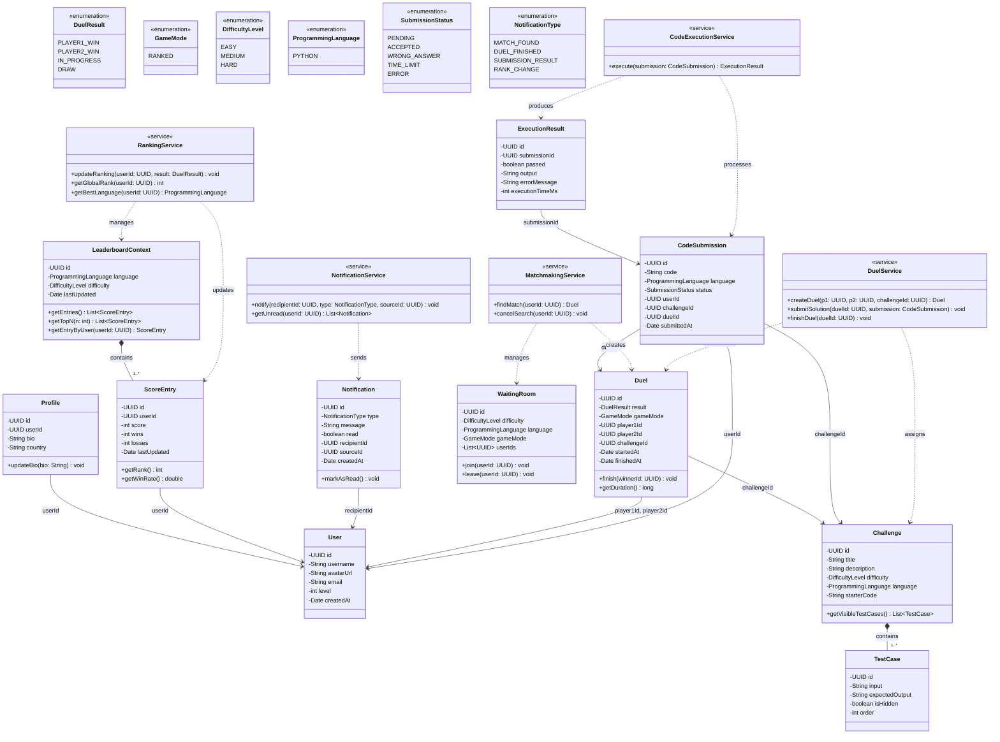

```mermaid
classDiagram

    %% ══════════════════════════════════════
    %% ENUMERATIONS
    %% ══════════════════════════════════════

    class DuelResult {
        <<enumeration>>
        PLAYER1_WIN
        PLAYER2_WIN
        IN_PROGRESS
        DRAW
    }

    class GameMode {
        <<enumeration>>
        RANKED
    }

    class DifficultyLevel {
        <<enumeration>>
        EASY
        MEDIUM
        HARD
    }

    class ProgrammingLanguage {
        <<enumeration>>
        PYTHON
    }

    class SubmissionStatus {
        <<enumeration>>
        PENDING
        ACCEPTED
        WRONG_ANSWER
        TIME_LIMIT
        ERROR
    }

    class NotificationType {
        <<enumeration>>
        MATCH_FOUND
        DUEL_FINISHED
        SUBMISSION_RESULT
        RANK_CHANGE
    }

    %% ══════════════════════════════════════
    %% DOMAIN ENTITIES
    %% ══════════════════════════════════════

    class User {
        -UUID id
        -String username
        -String avatarUrl
        -String email
        -int level
        -Date createdAt
    }

    class Profile {
        -UUID id
        -UUID userId
        -String bio
        -String country
        +updateBio(bio: String) void
    }

    class LeaderboardContext {
        -UUID id
        -ProgrammingLanguage language
        -DifficultyLevel difficulty
        -Date lastUpdated
        +getEntries() List~ScoreEntry~
        +getTopN(n: int) List~ScoreEntry~
        +getEntryByUser(userId: UUID) ScoreEntry
    }

    class ScoreEntry {
        -UUID id
        -UUID userId
        -int score
        -int wins
        -int losses
        -Date lastUpdated
        +getRank() int
        +getWinRate() double
    }

    class Notification {
        -UUID id
        -NotificationType type
        -String message
        -boolean read
        -UUID recipientId
        -UUID sourceId
        -Date createdAt
        +markAsRead() void
    }

    class WaitingRoom {
        -UUID id
        -DifficultyLevel difficulty
        -ProgrammingLanguage language
        -GameMode gameMode
        -List~UUID~ userIds
        +join(userId: UUID) void
        +leave(userId: UUID) void
    }

    class Duel {
        -UUID id
        -DuelResult result
        -GameMode gameMode
        -UUID player1Id
        -UUID player2Id
        -UUID challengeId
        -Date startedAt
        -Date finishedAt
        +finish(winnerId: UUID) void
        +getDuration() long
    }

    class Challenge {
        -UUID id
        -String title
        -String description
        -DifficultyLevel difficulty
        -ProgrammingLanguage language
        -String starterCode
        +getVisibleTestCases() List~TestCase~
    }

    class TestCase {
        -UUID id
        -String input
        -String expectedOutput
        -boolean isHidden
        -int order
    }

    class CodeSubmission {
        -UUID id
        -String code
        -ProgrammingLanguage language
        -SubmissionStatus status
        -UUID userId
        -UUID challengeId
        -UUID duelId
        -Date submittedAt
    }

    class ExecutionResult {
        -UUID id
        -UUID submissionId
        -boolean passed
        -String output
        -String errorMessage
        -int executionTimeMs
    }

    %% ══════════════════════════════════════
    %% SERVICE LAYER
    %% ══════════════════════════════════════

    class MatchmakingService {
        <<service>>
        +findMatch(userId: UUID) Duel
        +cancelSearch(userId: UUID) void
    }

    class CodeExecutionService {
        <<service>>
        +execute(submission: CodeSubmission) ExecutionResult
    }

    class DuelService {
        <<service>>
        +createDuel(p1: UUID, p2: UUID, challengeId: UUID) Duel
        +submitSolution(duelId: UUID, submission: CodeSubmission) void
        +finishDuel(duelId: UUID) void
    }

    class RankingService {
        <<service>>
        +updateRanking(userId: UUID, result: DuelResult) void
        +getGlobalRank(userId: UUID) int
        +getBestLanguage(userId: UUID) ProgrammingLanguage
    }

    class NotificationService {
        <<service>>
        +notify(recipientId: UUID, type: NotificationType, sourceId: UUID) void
        +getUnread(userId: UUID) List~Notification~
    }

    %% ══════════════════════════════════════
    %% COMPOSITIONS
    %% ══════════════════════════════════════

    LeaderboardContext *-- "1..*" ScoreEntry : contains
    Challenge *-- "1..*" TestCase : contains

    %% ══════════════════════════════════════
    %% ENTITY ASSOCIATIONS (unidirectional)
    %% ══════════════════════════════════════

    Profile --> User : userId
    ScoreEntry --> User : userId
    Notification --> User : recipientId
    Duel --> User : player1Id, player2Id
    Duel --> Challenge : challengeId
    CodeSubmission --> User : userId
    CodeSubmission --> Challenge : challengeId
    CodeSubmission --> Duel : duelId
    ExecutionResult --> CodeSubmission : submissionId

    %% ══════════════════════════════════════
    %% SERVICE DEPENDENCIES
    %% ══════════════════════════════════════

    MatchmakingService ..> WaitingRoom : manages
    MatchmakingService ..> Duel : creates
    CodeExecutionService ..> CodeSubmission : processes
    CodeExecutionService ..> ExecutionResult : produces
    DuelService ..> Duel : orchestrates
    DuelService ..> Challenge : assigns
    RankingService ..> ScoreEntry : updates
    RankingService ..> LeaderboardContext : manages
    NotificationService ..> Notification : sends
```
