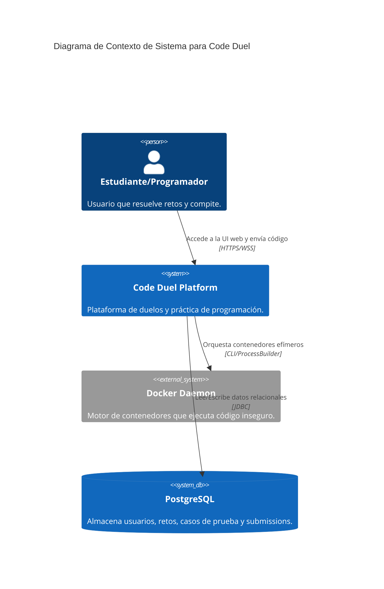

# Arquitectura General de Code Duel

¡Acá no hacemos las cosas porque sí, hermano! Cada decisión tiene una base conceptual. 
Code Duel utiliza una arquitectura de **Monolito Modular** en el backend y una estructura de **SPA Ligera (Single Page Application)** escrita en Vanilla JS en el frontend.

## ¿Por qué un Monolito Modular?

Muchos se vuelven locos intentando meter microservicios desde el día uno sin entender los costos operativos. Nosotros elegimos un **Monolito Modular**. 
- **Simplicidad de despliegue:** Un solo `.jar` corre toda la API.
- **Baja latencia:** Las llamadas entre el motor de ejecución, matchmaking y base de datos ocurren en memoria.
- **Separación lógica:** Organizamos el código por dominio (Auth, Challenges, Submissions, Duels), de modo que si mañana necesitamos separar el motor de ejecución a un worker en Python, las fronteras ya están definidas en el código Java.

## Componentes del Sistema

1. **Frontend (Capa de Presentación):** 
   Consiste en archivos estáticos servidos desde cualquier CDN o servidor web. Se comunica exclusivamente mediante HTTP/REST (y posteriormente WebSockets) con el Backend.

2. **Backend (API + Orquestador):**
   La aplicación Spring Boot maneja:
   - Identidad y Sesiones (JWT stateless).
   - Catálogo de problemas y validación de reglas de negocio.
   - Interacción con la API local de Docker para levantar contenedores de ejecución.

3. **Base de Datos Relacional (PostgreSQL):**
   Manejada de forma estricta mediante **Flyway**. Las migraciones son la única fuente de la verdad. NUNCA se usa `spring.jpa.hibernate.ddl-auto=update` en producción. 

4. **Entorno Aislado (Docker Daemon):**
   El servidor donde corra el backend debe tener el daemon de Docker accesible. Es responsable de ejecutar código inseguro de los usuarios.

## Diagrama C4 (Nivel Contexto)

## Patrones Aplicados

- **Repository Pattern:** Para abstraer el acceso a datos.
- **Strategy Pattern (Futuro):** Para el motor de ejecución, permitiendo cambiar fácilmente de Python a Java, C++, etc.
- **Stateless Authentication:** JWT para evitar lidiar con la sincronización de estado de sesiones si escalamos horizontalmente.
