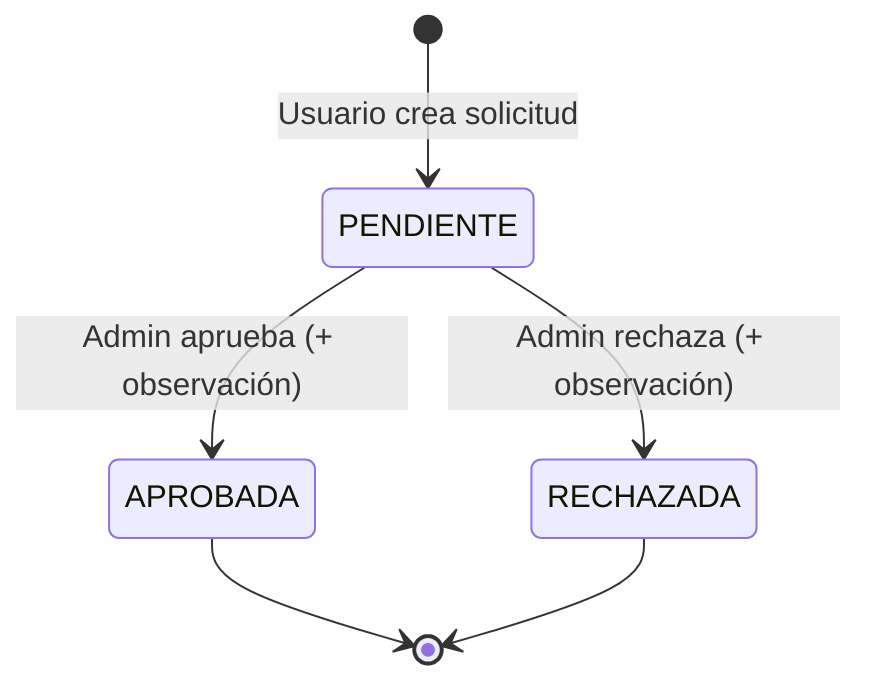

# Módulo 2 – Sistema de Solicitudes con Flujo de Estados

## Contexto

Depende del **paso previo compartido** definido en el Módulo 1 (agregar `role` a `User`), ya que este módulo requiere distinguir entre usuarios autenticados normales y administradores (ADMIN).

---

## Archivos Nuevos del Módulo 2

### Estructura de archivos a crear

```
src/main/java/com/codeduel/backend/
├── model/
│   ├── Solicitud.java                  [NEW]
│   └── enums/
│       ├── TipoSolicitud.java          [NEW]
│       └── EstadoSolicitud.java        [NEW]
├── dto/
│   ├── SolicitudRequest.java           [NEW]
│   └── SolicitudResponse.java          [NEW]
├── repository/
│   └── SolicitudRepository.java        [NEW]
├── service/
│   └── SolicitudService.java           [NEW]
└── controller/
    └── SolicitudController.java        [NEW]

src/main/resources/db/migration/
└── V8__solicitudes.sql                 [NEW]
```

---

### [NEW] Migración Flyway — `V8__solicitudes.sql`
**Ruta**: `src/main/resources/db/migration/V8__solicitudes.sql`

```sql
CREATE TABLE solicitudes (
    id                BIGSERIAL PRIMARY KEY,
    solicitante_id    UUID NOT NULL REFERENCES users(id),
    tipo              VARCHAR(20) NOT NULL CHECK (tipo IN ('SOPORTE', 'ACCESO', 'INFORMACION')),
    descripcion       TEXT NOT NULL,
    estado            VARCHAR(20) NOT NULL DEFAULT 'PENDIENTE' CHECK (estado IN ('PENDIENTE', 'APROBADA', 'RECHAZADA')),
    observacion       TEXT,
    fecha_creacion    TIMESTAMP NOT NULL DEFAULT CURRENT_TIMESTAMP,
    fecha_resolucion  TIMESTAMP
);

CREATE INDEX idx_solicitudes_solicitante ON solicitudes(solicitante_id);
CREATE INDEX idx_solicitudes_estado ON solicitudes(estado);
```

---

### [NEW] Enum — `TipoSolicitud.java`
**Ruta**: `src/main/java/com/codeduel/backend/model/enums/TipoSolicitud.java`

```java
package com.codeduel.backend.model.enums;

public enum TipoSolicitud {
    SOPORTE,
    ACCESO,
    INFORMACION
}
```

> [!NOTE]
> El enunciado dice `INFORMACIÓN` con tilde, pero los enums de Java no soportan tildes. Se usará `INFORMACION` sin tilde. El mapeo del JSON puede aceptar ambos si se desea, pero el almacenamiento será sin tilde.

---

### [NEW] Enum — `EstadoSolicitud.java`
**Ruta**: `src/main/java/com/codeduel/backend/model/enums/EstadoSolicitud.java`

```java
package com.codeduel.backend.model.enums;

public enum EstadoSolicitud {
    PENDIENTE,
    APROBADA,
    RECHAZADA
}
```

---

### [NEW] Entidad — `Solicitud.java`
**Ruta**: `src/main/java/com/codeduel/backend/model/Solicitud.java`

```java
package com.codeduel.backend.model;

import com.codeduel.backend.model.enums.EstadoSolicitud;
import com.codeduel.backend.model.enums.TipoSolicitud;
import jakarta.persistence.*;
import lombok.*;
import org.hibernate.annotations.CreationTimestamp;

import java.time.LocalDateTime;

@Entity
@Table(name = "solicitudes")
@Getter @Setter
@NoArgsConstructor @AllArgsConstructor
@Builder
public class Solicitud {

    @Id
    @GeneratedValue(strategy = GenerationType.IDENTITY)
    private Long id;

    @ManyToOne(fetch = FetchType.LAZY)
    @JoinColumn(name = "solicitante_id", nullable = false)
    private User solicitante;

    @Enumerated(EnumType.STRING)
    @Column(nullable = false, length = 20)
    private TipoSolicitud tipo;

    @Column(nullable = false, columnDefinition = "TEXT")
    private String descripcion;

    @Enumerated(EnumType.STRING)
    @Column(nullable = false, length = 20)
    @Builder.Default
    private EstadoSolicitud estado = EstadoSolicitud.PENDIENTE;

    @Column(columnDefinition = "TEXT")
    private String observacion;

    @CreationTimestamp
    @Column(name = "fecha_creacion", nullable = false, updatable = false)
    private LocalDateTime fechaCreacion;

    @Column(name = "fecha_resolucion")
    private LocalDateTime fechaResolucion;
}
```

---

### [NEW] DTO Request — `SolicitudRequest.java`
**Ruta**: `src/main/java/com/codeduel/backend/dto/SolicitudRequest.java`

```java
package com.codeduel.backend.dto;

import com.codeduel.backend.model.enums.TipoSolicitud;
import jakarta.validation.constraints.NotBlank;
import jakarta.validation.constraints.NotNull;
import lombok.*;

@Getter @Setter
@NoArgsConstructor @AllArgsConstructor
public class SolicitudRequest {

    @NotNull(message = "El tipo de solicitud es obligatorio")
    private TipoSolicitud tipo;

    @NotBlank(message = "La descripción es obligatoria")
    private String descripcion;
}
```

> [!NOTE]
> El usuario **no** envía el estado al crear — siempre se inicia como `PENDIENTE` automáticamente.

---

### [NEW] DTO Response — `SolicitudResponse.java`
**Ruta**: `src/main/java/com/codeduel/backend/dto/SolicitudResponse.java`

```java
package com.codeduel.backend.dto;

import com.codeduel.backend.model.enums.EstadoSolicitud;
import com.codeduel.backend.model.enums.TipoSolicitud;
import lombok.*;

import java.time.LocalDateTime;

@Getter @Setter
@NoArgsConstructor @AllArgsConstructor
@Builder
public class SolicitudResponse {
    private Long id;
    private String solicitanteUsername;
    private TipoSolicitud tipo;
    private String descripcion;
    private EstadoSolicitud estado;
    private String observacion;
    private LocalDateTime fechaCreacion;
    private LocalDateTime fechaResolucion;
}
```

---

### [NEW] Repositorio — `SolicitudRepository.java`
**Ruta**: `src/main/java/com/codeduel/backend/repository/SolicitudRepository.java`

```java
package com.codeduel.backend.repository;

import com.codeduel.backend.model.Solicitud;
import com.codeduel.backend.model.User;
import com.codeduel.backend.model.enums.EstadoSolicitud;
import org.springframework.data.jpa.repository.JpaRepository;
import org.springframework.stereotype.Repository;

import java.util.List;

@Repository
public interface SolicitudRepository extends JpaRepository<Solicitud, Long> {

    List<Solicitud> findBySolicitanteOrderByFechaCreacionDesc(User solicitante);

    long countByEstado(EstadoSolicitud estado);
}
```

---

### [NEW] Servicio — `SolicitudService.java`
**Ruta**: `src/main/java/com/codeduel/backend/service/SolicitudService.java`

```java
package com.codeduel.backend.service;

import com.codeduel.backend.dto.SolicitudRequest;
import com.codeduel.backend.dto.SolicitudResponse;
import com.codeduel.backend.exception.BadRequestException;
import com.codeduel.backend.exception.ResourceNotFoundException;
import com.codeduel.backend.model.Solicitud;
import com.codeduel.backend.model.User;
import com.codeduel.backend.model.enums.EstadoSolicitud;
import com.codeduel.backend.repository.SolicitudRepository;
import com.codeduel.backend.repository.UserRepository;
import lombok.RequiredArgsConstructor;
import org.springframework.stereotype.Service;
import org.springframework.transaction.annotation.Transactional;

import java.time.LocalDateTime;
import java.util.List;

@Service
@RequiredArgsConstructor
public class SolicitudService {

    private final SolicitudRepository solicitudRepository;
    private final UserRepository userRepository;

    @Transactional
    public SolicitudResponse crearSolicitud(String username, SolicitudRequest request) {
        User solicitante = findUser(username);

        Solicitud solicitud = Solicitud.builder()
                .solicitante(solicitante)
                .tipo(request.getTipo())
                .descripcion(request.getDescripcion())
                .build();
        // estado se inicializa en PENDIENTE por @Builder.Default

        solicitud = solicitudRepository.save(solicitud);
        return toResponse(solicitud);
    }

    public List<SolicitudResponse> getMisSolicitudes(String username) {
        User solicitante = findUser(username);
        return solicitudRepository.findBySolicitanteOrderByFechaCreacionDesc(solicitante)
                .stream().map(this::toResponse).toList();
    }

    public List<SolicitudResponse> getTodasSolicitudes() {
        return solicitudRepository.findAll()
                .stream().map(this::toResponse).toList();
    }

    @Transactional
    public SolicitudResponse aprobarSolicitud(Long id, String observacion) {
        return resolverSolicitud(id, EstadoSolicitud.APROBADA, observacion);
    }

    @Transactional
    public SolicitudResponse rechazarSolicitud(Long id, String observacion) {
        return resolverSolicitud(id, EstadoSolicitud.RECHAZADA, observacion);
    }

    private SolicitudResponse resolverSolicitud(Long id, EstadoSolicitud nuevoEstado, String observacion) {
        Solicitud solicitud = solicitudRepository.findById(id)
                .orElseThrow(() -> new ResourceNotFoundException(
                        "Solicitud no encontrada con id: " + id));

        if (solicitud.getEstado() != EstadoSolicitud.PENDIENTE) {
            throw new BadRequestException(
                    "La solicitud ya fue resuelta con estado: " + solicitud.getEstado());
        }

        solicitud.setEstado(nuevoEstado);
        solicitud.setObservacion(observacion);
        solicitud.setFechaResolucion(LocalDateTime.now());

        solicitud = solicitudRepository.save(solicitud);
        return toResponse(solicitud);
    }

    // Métodos de conteo para el panel del Módulo 3
    public long contarTotal() {
        return solicitudRepository.count();
    }

    public long contarPorEstado(EstadoSolicitud estado) {
        return solicitudRepository.countByEstado(estado);
    }

    private User findUser(String username) {
        return userRepository.findByUsername(username)
                .orElseThrow(() -> new ResourceNotFoundException("Usuario no encontrado"));
    }

    private SolicitudResponse toResponse(Solicitud s) {
        return SolicitudResponse.builder()
                .id(s.getId())
                .solicitanteUsername(s.getSolicitante().getUsername())
                .tipo(s.getTipo())
                .descripcion(s.getDescripcion())
                .estado(s.getEstado())
                .observacion(s.getObservacion())
                .fechaCreacion(s.getFechaCreacion())
                .fechaResolucion(s.getFechaResolucion())
                .build();
    }
}
```

---

### [NEW] Controlador — `SolicitudController.java`
**Ruta**: `src/main/java/com/codeduel/backend/controller/SolicitudController.java`

```java
package com.codeduel.backend.controller;

import com.codeduel.backend.dto.SolicitudRequest;
import com.codeduel.backend.dto.SolicitudResponse;
import com.codeduel.backend.service.SolicitudService;
import jakarta.validation.Valid;
import lombok.RequiredArgsConstructor;
import org.springframework.http.HttpStatus;
import org.springframework.http.ResponseEntity;
import org.springframework.security.core.annotation.AuthenticationPrincipal;
import org.springframework.security.core.userdetails.UserDetails;
import org.springframework.web.bind.annotation.*;

import java.util.List;

@RestController
@RequestMapping("/api/solicitudes")
@RequiredArgsConstructor
public class SolicitudController {

    private final SolicitudService solicitudService;

    @PostMapping
    public ResponseEntity<SolicitudResponse> crearSolicitud(
            @AuthenticationPrincipal UserDetails userDetails,
            @Valid @RequestBody SolicitudRequest request) {
        SolicitudResponse response = solicitudService.crearSolicitud(
                userDetails.getUsername(), request);
        return ResponseEntity.status(HttpStatus.CREATED).body(response);
    }

    @GetMapping("/mis-solicitudes")
    public ResponseEntity<List<SolicitudResponse>> getMisSolicitudes(
            @AuthenticationPrincipal UserDetails userDetails) {
        return ResponseEntity.ok(
                solicitudService.getMisSolicitudes(userDetails.getUsername()));
    }

    @GetMapping
    public ResponseEntity<List<SolicitudResponse>> getTodasSolicitudes() {
        // Protegido por SecurityConfig → solo ADMIN
        return ResponseEntity.ok(solicitudService.getTodasSolicitudes());
    }

    @PutMapping("/{id}/aprobar")
    public ResponseEntity<SolicitudResponse> aprobarSolicitud(
            @PathVariable Long id,
            @RequestParam String observacion) {
        return ResponseEntity.ok(solicitudService.aprobarSolicitud(id, observacion));
    }

    @PutMapping("/{id}/rechazar")
    public ResponseEntity<SolicitudResponse> rechazarSolicitud(
            @PathVariable Long id,
            @RequestParam String observacion) {
        return ResponseEntity.ok(solicitudService.rechazarSolicitud(id, observacion));
    }
}
```

---

## Detalle de Seguridad en `SecurityConfig`

Las reglas de autorización (definidas en el paso previo compartido del Módulo 1) aseguran que:

| Endpoint | Acceso |
|---|---|
| `POST /api/solicitudes` | Cualquier usuario autenticado |
| `GET /api/solicitudes/mis-solicitudes` | Cualquier usuario autenticado |
| `GET /api/solicitudes` | Solo ADMIN |
| `PUT /api/solicitudes/{id}/aprobar` | Solo ADMIN |
| `PUT /api/solicitudes/{id}/rechazar` | Solo ADMIN |

> [!IMPORTANT]
> El orden de las reglas en `SecurityConfig` es crucial. La regla más específica (`GET /api/solicitudes` → ADMIN) debe ir **antes** de la regla genérica (`/api/solicitudes/**` → authenticated). De lo contrario, el patrón genérico podría capturar la ruta antes.

---

## Flujo de Estados



- Una solicitud ya resuelta (APROBADA o RECHAZADA) **no puede** cambiar de estado. Se retorna 400 Bad Request.
- La observación es obligatoria al resolver (se recibe como `@RequestParam`).
- La `fechaResolucion` se registra automáticamente al momento de aprobar/rechazar.

---

## Códigos HTTP Esperados

| Endpoint | Éxito | Error |
|---|---|---|
| `POST /api/solicitudes` | 201 Created | 400 (validación) |
| `GET /api/solicitudes/mis-solicitudes` | 200 OK | 401/403 (no autenticado) |
| `GET /api/solicitudes` | 200 OK | 403 (no es ADMIN) |
| `PUT /api/solicitudes/{id}/aprobar` | 200 OK | 404 (no existe), 400 (ya resuelta), 403 (no ADMIN) |
| `PUT /api/solicitudes/{id}/rechazar` | 200 OK | 404 (no existe), 400 (ya resuelta), 403 (no ADMIN) |

---

## Verificación

- El Módulo 5 cubre las pruebas de seguridad para este controlador.
- Verificar manualmente que el flujo PENDIENTE → APROBADA y PENDIENTE → RECHAZADA funciona correctamente.
- Verificar que un intento de re-resolver una solicitud retorna 400.

---

## Orden de Implementación

1. Enums: `TipoSolicitud`, `EstadoSolicitud`
2. Migración V8
3. Entidad `Solicitud`
4. DTOs: `SolicitudRequest`, `SolicitudResponse`
5. Repositorio `SolicitudRepository`
6. Servicio `SolicitudService`
7. Controlador `SolicitudController`
