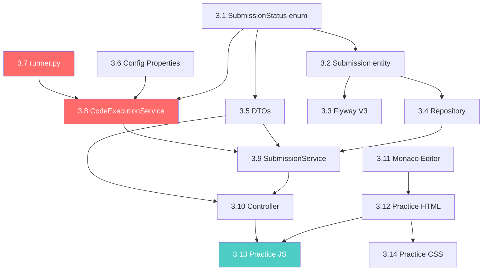

# Fase 3: Motor de Ejecución de Código — Plan Detallado

## Decisiones Confirmadas

| Decisión | Valor |
|----------|-------|
| Docker interaction | `ProcessBuilder` (sin docker-java) |
| Imagen Python | `python:3.12-alpine` |
| Librerías Python | Ninguna preinstalada |
| Persistencia submissions | ✅ Sí, entidad `Submission` |
| Timeout | Configurable por dificultad |
| Límite procesos (PIDs) | ✅ Sí |
| Límite CPU | ✅ Sí |
| Editor frontend | Monaco Editor (CDN, AMD loader) |
| Container por ejecución | 1 container corre TODOS los tests |
| Comparación output | Case-sensitive, trimmed |
| Mostrar expected (práctica) | ✅ Sí |
| Mostrar expected (competencia) | ❌ No (Fase 5) |
| Fail-fast | ❌ Ejecutar todos los tests |
| Mostrar stderr | ✅ Sí |

---

## Arquitectura de Ejecución

```
┌─────────────┐    POST /api/submissions/practice    ┌──────────────────┐
│   Frontend   │ ──────────────────────────────────► │ SubmissionCtrl   │
│  (Monaco)    │                                      └────────┬─────────┘
│              │ ◄──────────────────────────────────           │
│  Results UI  │    SubmissionResponse (JSON)          ┌───────▼─────────┐
└─────────────┘                                        │ SubmissionSvc   │
                                                       │  - Persist      │
                                                       │  - Orchestrate  │
                                                       └───────┬─────────┘
                                                               │
                                                       ┌───────▼─────────┐
                                                       │ CodeExecService │
                                                       │  - Temp dir     │
                                                       │  - ProcessBuild │
                                                       │  - Parse JSON   │
                                                       └───────┬─────────┘
                                                               │
                                              docker run --rm --network none ...
                                                               │
                                                       ┌───────▼─────────┐
                                                       │  Docker Container│
                                                       │  python:3.12-alp│
                                                       │                 │
                                                       │  runner.py      │
                                                       │   ├ solution.py │
                                                       │   └ tests.json  │
                                                       └─────────────────┘
```

### Flujo dentro del Container

`runner.py` (montado read-only en `/app`):
1. Lee `/app/test_cases.json`
2. Por cada test case → `subprocess.run(['python3', '/app/solution.py'], stdin=input, timeout=X)`
3. Captura stdout, stderr, exit code, tiempo
4. Imprime JSON estructurado a stdout del container

### Comando Docker (ejemplo)

```bash
docker run --rm \
  --network none \
  --memory 128m \
  --cpus 0.5 \
  --pids-limit 50 \
  --read-only \
  --tmpfs /tmp:size=10m \
  -v /path/to/temp:/app:ro \
  python:3.12-alpine \
  python3 /app/runner.py
```

---

## Configuración de Timeouts

```yaml
# application.yml (nuevo bloque)
code-execution:
  docker:
    image: python:3.12-alpine
    memory-limit: 128m
    cpu-limit: "0.5"
    pids-limit: 50
  timeouts:
    easy: 3       # segundos por test
    medium: 5
    hard: 10
  container-timeout-buffer: 5  # segundos extra para el container total
```

**Timeout total del container** = (per-test-timeout × num_tests) + buffer

---

## Tasks Atómicas

### Backend

#### Task 3.1 — Enum `SubmissionStatus`
- **Archivo:** `model/enums/SubmissionStatus.java`
- **Valores:** `ACCEPTED`, `WRONG_ANSWER`, `TIME_LIMIT_EXCEEDED`, `RUNTIME_ERROR`
- **Dependencias:** Ninguna
- **Estimación:** 5 min

#### Task 3.2 — Entidad `Submission`
- **Archivo:** `model/Submission.java`
- **Campos:**

| Campo | Tipo | Notas |
|-------|------|-------|
| id | UUID | PK auto-generado |
| user | User (ManyToOne) | FK → users |
| challenge | Challenge (ManyToOne) | FK → challenges |
| code | String (TEXT) | Código enviado |
| language | ProgrammingLanguage | Enum |
| overallStatus | SubmissionStatus | Resultado global |
| executionTimeMs | Integer | Tiempo total ms |
| createdAt | LocalDateTime | Timestamp |

- **Dependencias:** Task 3.1
- **Estimación:** 15 min

#### Task 3.3 — Migración Flyway `V3__submissions.sql`
- **Archivo:** `resources/db/migration/V3__submissions.sql`
- Tabla `submissions` con FK a `users` y `challenges`
- Index en `user_id` y `challenge_id` para queries de historial
- **Dependencias:** Task 3.2 (diseño de campos)
- **Estimación:** 10 min

#### Task 3.4 — `SubmissionRepository`
- **Archivo:** `repository/SubmissionRepository.java`
- Queries: `findByUserIdOrderByCreatedAtDesc`, `findByUserIdAndChallengeId`
- **Dependencias:** Task 3.2
- **Estimación:** 5 min

#### Task 3.5 — DTOs de Submission
- **Archivos:**
  - `dto/SubmissionRequest.java` → `code`, `challengeId`
  - `dto/SubmissionResponse.java` → `id`, `challengeId`, `challengeTitle`, `overallStatus`, `executionTimeMs`, `createdAt`, `testResults[]`
  - `dto/TestResultResponse.java` → `testOrder`, `status`, `executionTimeMs`, `input`, `expected`, `actual`, `stderr`
- **Dependencias:** Task 3.1
- **Estimación:** 15 min

#### Task 3.6 — `CodeExecutionProperties` (Config)
- **Archivo:** `config/CodeExecutionProperties.java`
- `@ConfigurationProperties(prefix = "code-execution")`
- Mapea timeouts por dificultad, límites de Docker
- **Dependencias:** Ninguna
- **Estimación:** 15 min

#### Task 3.7 — Python `runner.py`
- **Archivo:** `resources/docker/runner.py`
- Lee `test_cases.json`, ejecuta `solution.py` por cada test via `subprocess`
- Maneja: timeout, runtime error, output capture
- Output: JSON array a stdout
- **Dependencias:** Ninguna
- **Estimación:** 30 min

> [!IMPORTANT]
> Este script es el corazón de la ejecución. Debe manejar edge cases: código que imprime a stderr, scripts que no terminan, imports prohibidos, etc.

#### Task 3.8 — `CodeExecutionService`
- **Archivo:** `service/CodeExecutionService.java`
- Responsabilidades:
  1. Crear directorio temporal (`Files.createTempDirectory`)
  2. Escribir `solution.py` (código del usuario)
  3. Escribir `test_cases.json` (serializar test cases)
  4. Copiar `runner.py` desde resources
  5. Construir comando `docker run` con flags de seguridad
  6. Ejecutar via `ProcessBuilder`, capturar stdout
  7. Parsear JSON de resultados
  8. Comparar `actual.trim()` vs `expected.trim()` (case-sensitive)
  9. Asignar status por test y status global
  10. Limpiar directorio temporal (finally block)
- **Dependencias:** Task 3.6, Task 3.7, Task 3.1
- **Estimación:** 1.5 horas

#### Task 3.9 — `SubmissionService`
- **Archivo:** `service/SubmissionService.java`
- Responsabilidades:
  1. Recibir `SubmissionRequest` + userId
  2. Obtener `Challenge` con test cases
  3. Delegar ejecución a `CodeExecutionService`
  4. Construir y persistir entidad `Submission`
  5. Mapear a `SubmissionResponse` (incluyendo test results)
  6. Para modo práctica: incluir `input` y `expected` en response
- **Dependencias:** Task 3.4, Task 3.5, Task 3.8
- **Estimación:** 45 min

#### Task 3.10 — `SubmissionController`
- **Archivo:** `controller/SubmissionController.java`
- Endpoints:

| Método | Path | Descripción |
|--------|------|-------------|
| POST | `/api/submissions/practice` | Enviar código (modo práctica) |
| GET | `/api/submissions/me` | Historial del usuario |
| GET | `/api/submissions/me/{challengeId}` | Historial por challenge |

- **Dependencias:** Task 3.9, Task 3.5
- **Estimación:** 20 min

---

### Frontend

#### Task 3.11 — Monaco Editor (CDN + Init)
- **Modificar:** `index.html` (agregar script AMD loader)
- **Nuevo archivo:** `js/editor.js`
- Monaco via CDN: `cdn.jsdelivr.net/npm/monaco-editor@0.52.2/min/vs`
- Configurar: tema dark, lenguaje Python, font JetBrains Mono
- Exportar función `initEditor(containerId)` y `getEditorValue()`
- **Dependencias:** Ninguna
- **Estimación:** 30 min

#### Task 3.12 — Vista Practice (HTML)
- **Modificar:** `index.html`
- Nueva vista `#practice-view` con layout:

```
┌─────────────────────────────────────────────┐
│ Navbar (con botón "← Back to Dashboard")    │
├──────────────────┬──────────────────────────┤
│ Challenge Info   │ Monaco Editor            │
│ - Title          │                          │
│ - Description    │                          │
│ - Difficulty     │                          │
│ - Test count     │        [Run Code]        │
├──────────────────┴──────────────────────────┤
│ Results Panel                               │
│ Test 1: ✅ ACCEPTED (120ms)                 │
│ Test 2: ❌ WRONG_ANSWER — Expected: 8       │
│         Got: 53 | stderr: ...               │
└─────────────────────────────────────────────┘
```

- **Dependencias:** Task 3.11
- **Estimación:** 30 min

#### Task 3.13 — Practice JS Module
- **Nuevo archivo:** `js/practice.js`
- Funciones:
  - `loadPracticeView(challengeId)` — fetch challenge, render info, init editor
  - `submitCode()` — POST al backend, mostrar loading
  - `renderResults(response)` — pintar resultados por test case
  - `goBackToDashboard()` — navegación
- **Dependencias:** Task 3.11, Task 3.12, Task 3.10 (backend ready)
- **Estimación:** 1 hora

#### Task 3.14 — Practice CSS
- **Modificar:** `css/styles.css`
- Estilos para: practice layout, results panel, status badges (accepted=verde, wrong=rojo, TLE=amarillo, error=naranja), stderr collapsible
- Responsive: en móvil, editor y description stack vertical
- **Dependencias:** Task 3.12
- **Estimación:** 45 min

---

## Grafo de Dependencias



> [!NOTE]
> En rojo: tareas críticas (mayor complejidad/riesgo). En verde: integración final.

---

## Timeline (5 días útiles + 2 de buffer)

| Día | Tasks | Entregable verificable |
|-----|-------|----------------------|
| **1** | 3.1, 3.2, 3.3, 3.4, 3.5, 3.6 | Entidades + migración + config. App arranca sin errores. |
| **2** | 3.7, 3.8 | `runner.py` + `CodeExecutionService`. Test manual: ejecutar un script Python via Docker desde la app. |
| **3** | 3.9, 3.10, 3.11 | API completa + Monaco carga en browser. Test manual: POST desde Postman y ver resultado. |
| **4** | 3.12, 3.13, 3.14 | Vista práctica completa. Test manual: escribir código, enviar, ver resultados con colores. |
| **5** | Bug fixes + polish | Flujo completo funcional. Edge cases: timeout, syntax error, output vacío. |
| **6-7** | Buffer / prep sustentación | Preparar demo, poblar challenges de ejemplo, ensayar flujo. |

---

## Pre-requisitos antes de empezar

1. **Pull de la imagen Docker** (hacerlo YA, tarda unos segundos):
   ```bash
   docker pull python:3.12-alpine
   ```

2. **Verificar que Docker está corriendo** y accesible desde el proceso Java

3. **Tener al menos 2-3 challenges con test cases** en la DB para probar

---

## Riesgos y Mitigaciones

| Riesgo | Probabilidad | Mitigación |
|--------|-------------|------------|
| Docker no accesible desde Java | Media | Verificar permisos. En Windows, asegurar que Docker Desktop corre con WSL2. |
| Monaco no carga por CDN/CORS | Baja | Tener Ace Editor como plan B (1 línea de CDN). |
| Timeout de container no mata el proceso | Media | Usar `process.destroyForcibly()` + `docker kill` como fallback. |
| runner.py falla con edge cases | Alta | Probar: código vacío, print infinito, import os, fork bomb. |
| Directorio temporal no se limpia | Media | Usar try/finally + `FileUtils.deleteDirectory()`. |

---

## Estructura final de archivos (nuevos/modificados)

```
backend/src/main/java/com/codeduel/backend/
├── config/
│   └── CodeExecutionProperties.java          ← NUEVO
├── model/
│   ├── Submission.java                       ← NUEVO
│   └── enums/
│       └── SubmissionStatus.java             ← NUEVO
├── repository/
│   └── SubmissionRepository.java             ← NUEVO
├── service/
│   ├── CodeExecutionService.java             ← NUEVO
│   └── SubmissionService.java                ← NUEVO
├── controller/
│   └── SubmissionController.java             ← NUEVO
├── dto/
│   ├── SubmissionRequest.java                ← NUEVO
│   ├── SubmissionResponse.java               ← NUEVO
│   └── TestResultResponse.java               ← NUEVO
backend/src/main/resources/
├── db/migration/
│   └── V3__submissions.sql                   ← NUEVO
├── docker/
│   └── runner.py                             ← NUEVO

frontend/
├── index.html                                ← MODIFICADO (practice view + Monaco)
├── css/styles.css                            ← MODIFICADO (practice styles)
├── js/
│   ├── editor.js                             ← NUEVO
│   └── practice.js                           ← NUEVO
```
