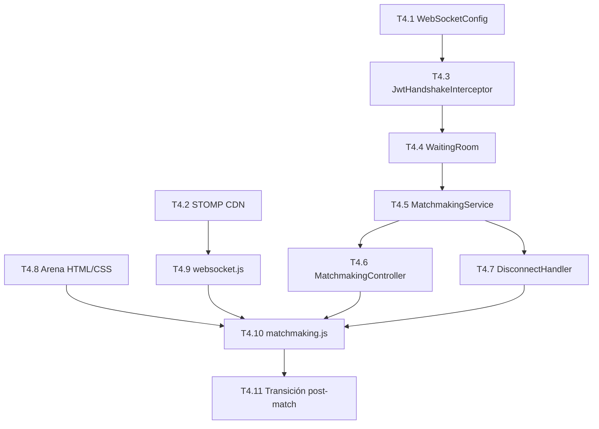

# Fase 4: Infraestructura en Tiempo Real y Matchmaking

## Resumen de Decisiones

| Decisión | Valor |
|---|---|
| Cliente STOMP | `@stomp/stompjs` vía CDN |
| Auth WebSocket | JWT como query param (`/ws?token=xxx`) |
| Colas | En memoria, separadas por `DifficultyLevel` |
| Match | FIFO inmediato al haber 2 personas (sin self-match) |
| Cola por usuario | Una sola a la vez |
| Timeout | 60s tras desconexión WS (no por tiempo en cola) |
| Conexión WS | Solo al entrar a la sección Arena |
| Vista | Nueva sección "Arena" separada del dashboard |
| Post-match | Pantalla transición "¡Oponente encontrado!" + countdown 3s |

---

## Dependencias entre tareas



---

## Backend

### T4.1 — WebSocketConfig (Spring STOMP)

**Archivo:** `config/WebSocketConfig.java`

**Qué hace:**
- Clase `@Configuration` que implementa `WebSocketMessageBrokerConfigurer`
- Registra endpoint `/ws` con `SockJS` fallback
- Habilita broker simple con prefijos:
  - `/topic` → mensajes broadcast (notificaciones de match)
  - `/queue` → mensajes privados (resultados individuales)
- Prefijo de aplicación: `/app` (para mensajes del cliente al servidor)

**Detalles clave:**
- `setAllowedOrigins` debe incluir los mismos orígenes que CORS (`localhost:3000`, `localhost:5500`, etc.)
- NO usar broker externo (RabbitMQ/etc.) — broker simple en memoria es suficiente

---

### T4.2 — STOMP.js vía CDN

**Archivo:** `frontend/index.html`

**Qué hace:**
- Agrega `<script>` de `@stomp/stompjs` desde CDN (jsDelivr)
- Versión recomendada: `7.x` (la más estable, no requiere SockJS del lado del cliente)

> [!IMPORTANT]
> `@stomp/stompjs` v7+ usa WebSocket nativo. Si se necesita SockJS fallback, agregar también `sockjs-client` CDN. Evaluar si es necesario — navegadores modernos soportan WS nativo.

---

### T4.3 — JwtHandshakeInterceptor

**Archivos:**
- `security/WebSocketAuthInterceptor.java` — `HandshakeInterceptor`
- `config/WebSocketConfig.java` — registrar el interceptor
- `security/StompPrincipal.java` — implementación simple de `java.security.Principal`

**Qué hace:**
1. Intercepta el HTTP handshake antes de upgrade a WS
2. Extrae el token del query param: `request.getServletRequest().getParameter("token")`
3. Usa `JwtService.extractUsername(token)` y `JwtService.extractUserId(token)` para validar
4. Si es válido: crea un `StompPrincipal(userId, username)` y lo pone en `attributes`
5. Si es inválido: retorna `false` (rechaza la conexión)

**`StompPrincipal`:**
- Implementa `java.security.Principal`
- Campos: `UUID userId`, `String username`
- `getName()` retorna `username`

**Seguridad:** El `SecurityConfig` ya tiene `/ws/**` como `permitAll()` (el handshake es público, la validación la hace el interceptor).

---

### T4.4 — WaitingRoom (Estructura de datos)

**Archivo:** `service/WaitingRoom.java`

**Qué hace:**
- Estructura thread-safe que mantiene las colas de espera
- `ConcurrentHashMap<DifficultyLevel, ConcurrentLinkedQueue<QueueEntry>>`
- Cada `QueueEntry` tiene: `UUID userId`, `String username`, `String sessionId`, `Instant joinedAt`

**Operaciones:**
| Método | Descripción |
|---|---|
| `addPlayer(DifficultyLevel, QueueEntry)` | Agrega a la cola. Retorna `Optional<QueueEntry>` del oponente si hay match |
| `removePlayer(UUID userId)` | Remueve de CUALQUIER cola (busca en las 3) |
| `isPlayerInQueue(UUID userId)` | Verifica si ya está en alguna cola |
| `getQueueSize(DifficultyLevel)` | Para debugging/logs |

**Lógica de match en `addPlayer`:**
1. Verificar que el usuario NO esté ya en alguna cola (`isPlayerInQueue`)
2. Peek en la cola de la dificultad seleccionada
3. Si hay alguien Y ese alguien NO es el mismo userId → `poll()` al oponente, retornar `Optional.of(opponent)`
4. Si la cola está vacía o solo se contiene a sí mismo → agregar a la cola, retornar `Optional.empty()`

> [!NOTE]
> La verificación de "no emparejarse consigo mismo" es por `userId`, no por `sessionId`. Un usuario podría tener dos tabs — pero la regla es que no puede estar en dos colas, así que el segundo intento se rechaza.

---

### T4.5 — MatchmakingService

**Archivo:** `service/MatchmakingService.java`

**Qué hace:**
- Orquesta el flujo de matchmaking usando `WaitingRoom` y `SimpMessagingTemplate`
- Es el cerebro que conecta la estructura de datos con la comunicación STOMP

**Métodos:**

**`joinQueue(UUID userId, String username, String sessionId, DifficultyLevel difficulty)`**
1. Validar que el usuario no esté ya en cola
2. Llamar `waitingRoom.addPlayer(difficulty, entry)`
3. Si retorna oponente → llamar `notifyMatch(player1, player2, difficulty)`
4. Si no → el usuario queda esperando (no se envía nada, el frontend ya muestra el timer)

**`leaveQueue(UUID userId)`**
1. Llamar `waitingRoom.removePlayer(userId)`
2. Log de la acción

**`notifyMatch(QueueEntry p1, QueueEntry p2, DifficultyLevel difficulty)`**
1. Crear un `matchId` (UUID random — será útil para Fase 5)
2. Construir payload: `{ matchId, opponentUsername, difficulty }`
3. Enviar a cada usuario su mensaje por `SimpMessagingTemplate.convertAndSendToUser()`
   - Destino: `/queue/matchmaking` (cola privada por usuario)
   - Cada uno recibe el nombre del OTRO como `opponentUsername`

**`handleDisconnect(String sessionId)`**
1. Programar un `ScheduledExecutorService` con delay de 60 segundos
2. Tras 60s, verificar si el usuario se reconectó (comparar sessionId actual vs guardado)
3. Si NO se reconectó → `leaveQueue(userId)`
4. Si se reconectó → cancelar la remoción

---

### T4.6 — MatchmakingController (STOMP)

**Archivo:** `controller/MatchmakingController.java`

**Qué hace:**
- Recibe mensajes STOMP del cliente
- Usa `@MessageMapping` para los dos flujos principales

**Endpoints STOMP:**

| Destino cliente | Método | Descripción |
|---|---|---|
| `/app/matchmaking/join` | `joinQueue()` | Payload: `{ "difficulty": "EASY" }` |
| `/app/matchmaking/leave` | `leaveQueue()` | Sin payload |

**Acceso al usuario:**
- El `Principal` viene del handshake interceptor → cast a `StompPrincipal`
- Extraer `userId` y `username` directamente

**Respuesta al cliente (destinos de suscripción):**

| Destino | Cuándo | Payload |
|---|---|---|
| `/user/queue/matchmaking` | Match encontrado | `{ matchId, opponentUsername, difficulty }` |
| `/user/queue/errors` | Error (ya en cola, etc.) | `{ message }` |

---

### T4.7 — WebSocketDisconnectHandler

**Archivo:** `config/WebSocketEventListener.java`

**Qué hace:**
- `@EventListener` para `SessionDisconnectEvent`
- Extrae el `sessionId` del evento
- Delega a `MatchmakingService.handleDisconnect(sessionId)`

**Flujo:**
1. Usuario cierra tab / pierde red → Spring dispara `SessionDisconnectEvent`
2. `WebSocketEventListener` lo captura
3. `MatchmakingService` programa remoción en 60s
4. Si el usuario vuelve antes → se cancela (necesita tracking de sessionId → userId)

**Tracking necesario:** Un `ConcurrentHashMap<String, UUID>` que mapee `sessionId → userId`, actualizado en connect/disconnect.

---

## Frontend

### T4.8 — Vista Arena (HTML + CSS)

**Archivos:**
- `frontend/index.html` — nueva sección `#arena-view`
- `frontend/css/styles.css` — estilos para la arena

**Estructura HTML:**

```
#arena-view
├── navbar (misma estructura que dashboard, con botón "← Back to Dashboard")
├── .arena-content
│   ├── .arena-header
│   │   ├── h2: "Arena de Duelos"
│   │   └── p: "Selecciona una dificultad y busca un oponente"
│   ├── .arena-difficulty-selector (estado: IDLE)
│   │   ├── button.difficulty-card[data-difficulty="EASY"] → "Easy" + icono
│   │   ├── button.difficulty-card[data-difficulty="MEDIUM"] → "Medium" + icono
│   │   └── button.difficulty-card[data-difficulty="HARD"] → "Hard" + icono
│   ├── .arena-searching (estado: SEARCHING, hidden por defecto)
│   │   ├── .searching-difficulty-badge → "Buscando en: EASY"
│   │   ├── .searching-timer → "00:00" (cuenta hacia arriba)
│   │   ├── .searching-animation → pulso/spinner
│   │   └── button.btn-cancel → "Cancelar Búsqueda"
│   └── .arena-match-found (estado: MATCHED, hidden por defecto)
│       ├── h2: "¡Oponente encontrado!"
│       ├── .match-players → "TuUsername VS OponenteUsername"
│       ├── .match-countdown → "Preparando arena... 3"
│       └── p: "La batalla comienza pronto..."
```

**Estados de la vista (toggle por CSS class):**
1. `arena--idle` → muestra selector de dificultad
2. `arena--searching` → muestra timer + cancel
3. `arena--matched` → muestra transición con countdown

**CSS — Estilo:**
- Cards de dificultad con colores: Verde (Easy), Amarillo (Medium), Rojo (Hard)
- Hover con scale + glow sutil
- Timer con fuente `JetBrains Mono` (ya importada)
- Animación de búsqueda: borde pulsante en la card seleccionada
- Countdown: número grande, animación de escala decreciente por segundo

---

### T4.9 — websocket.js (Módulo de conexión)

**Archivo:** `frontend/js/websocket.js`

**Qué hace:**
- Módulo que encapsula TODA la lógica de conexión STOMP
- Se conecta SOLO cuando se llama `ws.connect()` (al entrar a Arena)
- Se desconecta con `ws.disconnect()` (al salir de Arena)

**API pública:**

```
const ws = {
    connect()        → Conecta a /ws?token=JWT. Retorna Promise
    disconnect()     → Cierra limpiamente
    subscribe(dest, callback) → Suscribir a un destino STOMP
    send(dest, body) → Enviar mensaje al servidor
    isConnected()    → Boolean
    onDisconnect(cb) → Callback para desconexiones inesperadas
}
```

**Detalles:**
- URL: `ws://localhost:8080/ws?token=${api.getToken()}`
- Configurar `reconnectDelay: 5000` en el cliente STOMP (reconexión automática)
- El `debug` de STOMP se puede deshabilitar en producción
- Manejo de errores: si el token es inválido, el servidor rechaza → mostrar error y redirigir a login

---

### T4.10 — matchmaking.js (Lógica de matchmaking)

**Archivo:** `frontend/js/matchmaking.js`

**Qué hace:**
- Controla los estados de la vista Arena
- Conecta WebSocket al entrar, desconecta al salir
- Maneja timer, suscripciones STOMP, y transiciones

**Flujo:**

**`init()`** — Al navegar a Arena:
1. Conectar WebSocket (`ws.connect()`)
2. Suscribirse a `/user/queue/matchmaking` → `onMatchFound()`
3. Suscribirse a `/user/queue/errors` → `onError()`
4. Mostrar estado `idle` (selector de dificultad)

**`searchMatch(difficulty)`** — Al clickear dificultad:
1. Enviar STOMP: `/app/matchmaking/join` con `{ difficulty }`
2. Cambiar estado a `searching`
3. Iniciar timer con `setInterval` cada segundo (mostrar `MM:SS`)
4. Guardar referencia al interval para poder cancelar

**`cancelSearch()`** — Al clickear Cancelar:
1. Enviar STOMP: `/app/matchmaking/leave`
2. Detener timer (`clearInterval`)
3. Volver a estado `idle`

**`onMatchFound(message)`** — Al recibir match:
1. Detener timer
2. Cambiar estado a `matched`
3. Mostrar `opponentUsername` del mensaje
4. Iniciar countdown de 3 → 2 → 1
5. Al llegar a 0: `// TODO Fase 5: navigateTo('duel', matchId)`

**`destroy()`** — Al salir de Arena:
1. Cancelar búsqueda si estaba activa
2. Desconectar WebSocket
3. Limpiar timers

---

### T4.11 — Pantalla de transición post-match

**Incluido en T4.8 (HTML) y T4.10 (JS)**

**Qué muestra:**
- "¡Oponente encontrado!" (con animación de aparición)
- `"TuUsername VS OponenteUsername"` (VS grande y estilizado)
- Countdown: `3... 2... 1...` con animación de escala
- Texto: "Preparando arena..."
- Al terminar countdown: queda en pantalla (Fase 5 hará el redirect)

---

### T4.12 — Integración con navegación

**Archivos:** `frontend/js/app.js`, `frontend/index.html`

**Cambios:**
- Agregar botón "Arena" en el navbar del dashboard (al lado de logout)
- `navigateTo('arena')` → inicializa matchmaking (`matchmakingApp.init()`)
- Al salir de arena (back to dashboard) → `matchmakingApp.destroy()`
- Agregar `<script src="js/websocket.js">` y `<script src="js/matchmaking.js">` al HTML

---

## Orden de implementación sugerido

### Día 1: Backend WebSocket foundation
1. **T4.1** — `WebSocketConfig`
2. **T4.3** — `JwtHandshakeInterceptor` + `StompPrincipal`
3. Verificación: conectar desde Postman/browser console y ver que el handshake funciona

### Día 2: Backend Matchmaking
4. **T4.4** — `WaitingRoom`
5. **T4.5** — `MatchmakingService`
6. **T4.6** — `MatchmakingController`
7. **T4.7** — `WebSocketEventListener` (disconnect handler)
8. Verificación: logs de join/leave/match con dos conexiones STOMP simuladas

### Día 3: Frontend Vista + WebSocket
9. **T4.2** — CDN de STOMP.js
10. **T4.8** — HTML + CSS de Arena
11. **T4.9** — `websocket.js`

### Día 4: Frontend Matchmaking + Integración
12. **T4.10** — `matchmaking.js`
13. **T4.11** — Transición post-match (countdown)
14. **T4.12** — Navegación y wiring

### Día 5: Testing E2E manual
- Abrir 2 browsers con usuarios distintos
- Ambos entran a Arena → seleccionan misma dificultad
- Verificar match, nombres cruzados, countdown
- Probar cancelar búsqueda
- Probar desconexión (cerrar tab) y reconexión dentro de 60s

---

## Archivos nuevos (resumen)

| Archivo | Tipo |
|---|---|
| `backend/.../config/WebSocketConfig.java` | Config |
| `backend/.../security/WebSocketAuthInterceptor.java` | Seguridad |
| `backend/.../security/StompPrincipal.java` | Modelo |
| `backend/.../service/WaitingRoom.java` | Estructura datos |
| `backend/.../service/MatchmakingService.java` | Servicio |
| `backend/.../controller/MatchmakingController.java` | Controller |
| `backend/.../config/WebSocketEventListener.java` | Event handler |
| `frontend/js/websocket.js` | Módulo WS |
| `frontend/js/matchmaking.js` | Módulo UI |

## Archivos modificados

| Archivo | Cambio |
|---|---|
| `frontend/index.html` | CDN STOMP + vista Arena + scripts |
| `frontend/css/styles.css` | Estilos Arena |
| `frontend/js/app.js` | Navegación a Arena |

---

## Riesgos y mitigaciones

| Riesgo | Mitigación |
|---|---|
| STOMP.js v7 no soporta SockJS | Usar WebSocket nativo — OK para navegadores modernos. Si falla, agregar SockJS como fallback |
| Race condition en `WaitingRoom` | Usar `synchronized` blocks o `ConcurrentLinkedQueue` con operaciones atómicas |
| Usuario abre 2 tabs | `isPlayerInQueue()` previene doble cola. Segunda tab recibe error STOMP |
| Token expirado durante búsqueda | El reconnect del STOMP client enviará token nuevo. Si falla, redirigir a login |
