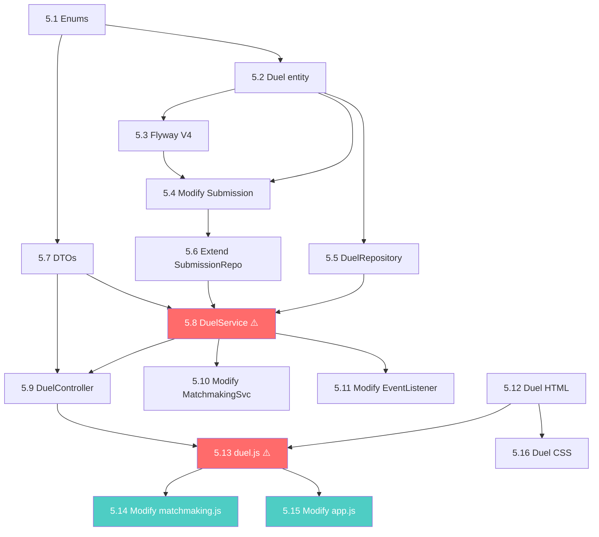

# Fase 5: La Arena de Duelos — Plan Detallado

## Decisiones Confirmadas

| # | Decisión | Valor |
|---|----------|-------|
| 1a | Estados del Duel | `WAITING`, `ACTIVE`, `FINISHED`, `CANCELLED` + campo `finishReason` |
| 1b | Tracking de duración | `startedAt` + `finishedAt` |
| 1c | Referencia al ganador | `winnerId` directo en `Duel` |
| 2 | Selección de Challenge | Aleatorio por dificultad, sin excluir ya-resueltos |
| 3a | Límite de submissions | Ilimitadas durante el duelo |
| 3b | Persistencia | Extender `Submission` existente con `duelId nullable` |
| 4 | Timeout del duelo | 20 minutos. Gana quien tenga más tests pasados |
| 5 | Arbitraje | Servidor es árbitro de timestamps. Empate solo en timeout igualado |
| 6 | Progreso oponente | Tests visibles (X/Y) + indicador de actividad reciente |
| 7 | Desconexión | Grace period 30s → forfeit. Oponente sigue jugando |
| 8 | Layout frontend | Split vertical, HUD superior, resultados propios debajo del editor |
| 9 | matchId → duelId | `matchId` reemplazado por `duelId` real (UUID de entidad) |

---

## Arquitectura del Duelo

```
┌──────────────────────────────────────────────────────────────────────┐
│                        LIFECYCLE DEL DUELO                           │
│                                                                      │
│  WaitingRoom          MatchmakingService           DuelService       │
│  ┌─────────┐          ┌──────────────────┐    ┌──────────────────┐  │
│  │ Queue   │ match!   │ notifyMatch()    │    │ createDuel()     │  │
│  │ EASY    │────────► │  → delega a      │───►│  → Duel(WAITING) │  │
│  │ MEDIUM  │          │    DuelService   │    │  → selectChallge │  │
│  │ HARD    │          └──────────────────┘    │  → Duel(ACTIVE)  │  │
│  └─────────┘                                  │  → notify STOMP  │  │
│                                               └────────┬─────────┘  │
│                                                        │            │
│  ┌─────────────────────────────────────────────────────▼─────────┐  │
│  │                    DUELO ACTIVO (≤20 min)                      │  │
│  │                                                                │  │
│  │  Player 1 ──STOMP──► /app/duel/submit ──► DuelService         │  │
│  │                                            ├─ CodeExecSvc     │  │
│  │  Player 2 ──STOMP──► /app/duel/submit ──► │  (async)          │  │
│  │                                            ├─ Persist result  │  │
│  │  ◄──── /topic/duel/{id}/progress ◄────────┤  ├─ Broadcast     │  │
│  │  ◄──── /user/queue/duel/result   ◄────────┘  └─ Check winner  │  │
│  │                                                                │  │
│  │  Timer: ScheduledExecutorService (20 min)                      │  │
│  │  Disconnect: 30s grace → FORFEIT                               │  │
│  └────────────────────────────────────────────────────────────────┘  │
│                                                                      │
│  ┌────────────────────────────────────────────────────────────────┐  │
│  │                    DUELO FINALIZADO                             │  │
│  │  → finishReason: SOLVED | TIMEOUT | FORFEIT                    │  │
│  │  → winnerId: UUID | null (empate)                              │  │
│  │  → Broadcast DUEL_FINISHED a ambos jugadores                   │  │
│  └────────────────────────────────────────────────────────────────┘  │
└──────────────────────────────────────────────────────────────────────┘
```

### Canales STOMP del Duelo

| Canal | Dirección | Contenido |
|-------|-----------|-----------|
| `/user/queue/matchmaking` | Server → User | `MATCH_FOUND` con duelId + challenge info |
| `/app/duel/submit` | User → Server | Código del jugador |
| `/user/queue/duel/result` | Server → User | Resultado PRIVADO de su submission |
| `/topic/duel/{duelId}/progress` | Server → Ambos | Progreso PÚBLICO (X/Y tests por jugador) |
| `/topic/duel/{duelId}/finished` | Server → Ambos | Resultado final del duelo |

---

## Nuevos Enums

### `DuelStatus`

```
WAITING    → Duel creado, esperando que ambos carguen la arena
ACTIVE     → Duelo en curso, timer corriendo
FINISHED   → Duelo terminado normalmente
CANCELLED  → Duelo cancelado (ambos desconectados, error de sistema)
```

### `DuelFinishReason`

```
SOLVED     → Un jugador resolvió todos los tests primero
TIMEOUT    → Se acabaron los 20 minutos
FORFEIT    → Un jugador abandonó/desconectó (30s grace expiró)
```

---

## Tasks Atómicas

### Backend

#### Task 5.1 — Enums `DuelStatus` y `DuelFinishReason`
- **Archivos:**
  - `model/enums/DuelStatus.java`
  - `model/enums/DuelFinishReason.java`
- **Valores:** Ver sección anterior
- **Dependencias:** Ninguna
- **Estimación:** 5 min

#### Task 5.2 — Entidad `Duel`
- **Archivo:** `model/Duel.java`
- **Campos:**

| Campo | Tipo | Notas |
|-------|------|-------|
| id | UUID | PK auto-generado |
| player1 | User (ManyToOne) | FK → users |
| player2 | User (ManyToOne) | FK → users |
| challenge | Challenge (ManyToOne) | FK → challenges |
| status | DuelStatus | Enum, default WAITING |
| finishReason | DuelFinishReason | Nullable, se llena al terminar |
| winner | User (ManyToOne) | Nullable FK → users |
| difficulty | DifficultyLevel | Copiado del match |
| startedAt | LocalDateTime | Cuando pasa a ACTIVE |
| finishedAt | LocalDateTime | Cuando pasa a FINISHED/CANCELLED |
| createdAt | LocalDateTime | Timestamp de creación |

- **Dependencias:** Task 5.1
- **Estimación:** 20 min

#### Task 5.3 — Migración Flyway `V4__duels.sql`
- **Archivo:** `resources/db/migration/V4__duels.sql`
- Tabla `duels` con FKs a `users` (×3: player1, player2, winner) y `challenges`
- `ALTER TABLE submissions ADD COLUMN duel_id UUID REFERENCES duels(id)` — nullable
- Index en `duel_id` para queries de submissions por duelo
- **Dependencias:** Task 5.2
- **Estimación:** 15 min

#### Task 5.4 — Modificar entidad `Submission`
- **Archivo:** `model/Submission.java` (MODIFICAR)
- **Agregar:**
  - `@ManyToOne(fetch = LAZY) @JoinColumn(name = "duel_id") private Duel duel;` — nullable
- **Dependencias:** Task 5.2, Task 5.3
- **Estimación:** 5 min

#### Task 5.5 — `DuelRepository`
- **Archivo:** `repository/DuelRepository.java`
- Queries:
  - `findById(UUID)` — heredado
  - `Optional<Duel> findActiveByUserId(UUID userId)` — query custom JPQL que busca status = ACTIVE y (player1.id = userId OR player2.id = userId)
- **Dependencias:** Task 5.2
- **Estimación:** 10 min

#### Task 5.6 — Extender `SubmissionRepository`
- **Archivo:** `repository/SubmissionRepository.java` (MODIFICAR)
- **Agregar queries:**
  - `findByDuelIdAndUserId(UUID duelId, UUID userId)` — submissions de un jugador en un duelo
  - `countByDuelIdAndUserIdAndOverallStatus(UUID duelId, UUID userId, SubmissionStatus status)` — contar ACCEPTED
- **Dependencias:** Task 5.4
- **Estimación:** 10 min

#### Task 5.7 — DTOs del Duelo
- **Archivos nuevos:**
  - `dto/DuelStartMessage.java` → `duelId`, `opponentUsername`, `difficulty`, `challengeTitle`, `challengeDescription`, `testCaseCount`, `timeoutMinutes`
  - `dto/DuelSubmitMessage.java` → `duelId`, `code` (recibido del cliente por STOMP)
  - `dto/DuelProgressMessage.java` → `duelId`, `playerUsername`, `testsPassedCount`, `totalTests`, `lastActivity` (timestamp)
  - `dto/DuelFinishedMessage.java` → `duelId`, `winnerUsername` (nullable), `finishReason`, `player1TestsPassed`, `player2TestsPassed`
  - `dto/DuelSubmissionResultMessage.java` → Reutiliza campos de `SubmissionResponse` + `testsPassedCount`, `totalTests`
- **Dependencias:** Task 5.1
- **Estimación:** 25 min

#### Task 5.8 — `DuelService` (CORE ⚠️)
- **Archivo:** `service/DuelService.java`
- **Responsabilidades:**

1. **`createDuel(player1, player2, difficulty)`**
   - Seleccionar challenge aleatorio (`ChallengeRepository.findRandomByDifficulty`)
   - Crear entidad `Duel(WAITING)` → persistir → transicionar a `ACTIVE`
   - Setear `startedAt = LocalDateTime.now()`
   - Programar timeout (20 min) con `ScheduledExecutorService`
   - Notificar ambos jugadores via STOMP con `DuelStartMessage`
   - Retornar `duelId`

2. **`submitCode(duelId, userId, code)`**
   - Validar: duelo existe, está ACTIVE, usuario es participante
   - Ejecutar código **async** (delegar a `CodeExecutionService` en thread pool separado)
   - Persistir `Submission` con referencia al `duel`
   - Enviar resultado PRIVADO al jugador: `/user/queue/duel/result`
   - Calcular mejor progreso del jugador y broadcast PÚBLICO: `/topic/duel/{id}/progress`
   - Si ALL tests ACCEPTED → `finishDuel(SOLVED, winnerId)`

3. **`finishDuel(duelId, reason, winnerId)`**
   - Transicionar a `FINISHED`, setear `finishedAt`, `finishReason`, `winnerId`
   - Cancelar timer de timeout
   - Broadcast `DuelFinishedMessage` a `/topic/duel/{id}/finished`

4. **`handleTimeout(duelId)`** (invocado por scheduler)
   - Si duelo sigue ACTIVE → determinar ganador por más tests pasados
   - Empate si ambos tienen mismo número → winnerId = null
   - `finishDuel(TIMEOUT, winnerId|null)`

5. **`handlePlayerDisconnect(userId)`**
   - Buscar duelo activo del usuario
   - Programar 30s grace period con `ScheduledExecutorService`
   - Si expira → `finishDuel(FORFEIT, otroJugadorId)`

6. **`handlePlayerReconnect(userId)`**
   - Cancelar pending forfeit si existe

- **Thread safety:** `ConcurrentHashMap` para timers de timeout y grace periods activos
- **Dependencias:** Task 5.2, Task 5.5, Task 5.6, Task 5.7
- **Estimación:** 3 horas (task más compleja de la fase)

> [!IMPORTANT]
> Este servicio es el corazón de la Fase 5. Maneja concurrencia (dos jugadores submitiendo simultáneamente), timers, y estado distribuido via STOMP. La ejecución de código DEBE ser async para no bloquear el thread de STOMP.

#### Task 5.9 — `DuelController` (STOMP)
- **Archivo:** `controller/DuelController.java`
- **Message mappings:**

| Destino | Método | Descripción |
|---------|--------|-------------|
| `/app/duel/submit` | `handleSubmission(@Payload, Principal)` | Recibe código durante duelo activo |

- El controller extrae `StompPrincipal`, valida, y delega a `DuelService.submitCode()`
- **Dependencias:** Task 5.8, Task 5.7
- **Estimación:** 30 min

#### Task 5.10 — Modificar `MatchmakingService`
- **Archivo:** `service/MatchmakingService.java` (MODIFICAR)
- **Cambios:**
  - Inyectar `DuelService`
  - En `notifyMatch()`: eliminar generación de `matchId` random y envío directo de `MatchFoundMessage`
  - Delegar a `DuelService.createDuel(player1, player2, difficulty)` — este se encarga de notificar por STOMP
- **Dependencias:** Task 5.8
- **Estimación:** 30 min

#### Task 5.11 — Modificar `WebSocketEventListener`
- **Archivo:** `config/WebSocketEventListener.java` (MODIFICAR)
- **Cambios:**
  - En disconnect: además de `matchmakingService.handleDisconnect()`, llamar `duelService.handlePlayerDisconnect(userId)`
  - En connect: además de `registerSession()`, llamar `duelService.handlePlayerReconnect(userId)`
- **Dependencias:** Task 5.8
- **Estimación:** 15 min

---

### Frontend

#### Task 5.12 — Vista Duel (HTML)
- **Archivo:** `index.html` (MODIFICAR)
- **Nueva sección** `#duel-view` con layout:

```
┌─────────────────────────────────────────────────────────┐
│  HUD: [Timer 19:42] [Tú: 3/5 ✅] [Oponente: 2/5 🔴]  │
├────────────────────────┬────────────────────────────────┤
│  Challenge Info        │  Monaco Editor                 │
│  - Title               │                                │
│  - Description         │                                │
│  - Difficulty badge    │                                │
│  - Test count          │        [▶ Submit Code]         │
├────────────────────────┴────────────────────────────────┤
│  Results Panel (your submissions only)                   │
│  Attempt #3: ✅ 5/5 tests passed (340ms)                │
│  Attempt #2: ❌ 3/5 — Wrong Answer on Test 4            │
└─────────────────────────────────────────────────────────┘

End-of-Match Modal (overlay, hidden by default):
┌─────────────────────────────────────────────────┐
│  🏆 VICTORY / 💀 DEFEAT / 🤝 DRAW              │
│  Reason: Solved / Timeout / Forfeit             │
│  [Back to Dashboard]                            │
└─────────────────────────────────────────────────┘
```

- **Dependencias:** Ninguna
- **Estimación:** 45 min

#### Task 5.13 — `duel.js` Module (CORE ⚠️)
- **Archivo nuevo:** `js/duel.js`
- **Estado interno:**

```javascript
const duelApp = {
    _duelId: null,
    _challenge: null,
    _myUsername: null,
    _opponentUsername: null,
    _myProgress: { testsPassed: 0, totalTests: 0 },
    _opponentProgress: { testsPassed: 0, totalTests: 0 },
    _timerInterval: null,
    _endTime: null,           // startedAt + 20min
    _submitting: false,
    _progressSub: null,       // STOMP subscription
    _resultSub: null,         // STOMP subscription
    _finishedSub: null,       // STOMP subscription
    _attemptCount: 0,
};
```

- **Funciones:**

| Función | Responsabilidad |
|---------|----------------|
| `init(duelData)` | Recibe `DuelStartMessage`, renderiza challenge, inicia Monaco, suscribe a 3 canales STOMP, arranca countdown timer |
| `submitCode()` | Envía código via STOMP `/app/duel/submit`, muestra loading, incrementa attempt count |
| `_onSubmissionResult(data)` | Renderiza resultado privado debajo del editor, actualiza progreso propio en HUD |
| `_onProgressUpdate(data)` | Actualiza HUD del oponente (X/Y tests + dot de actividad reciente) |
| `_onDuelFinished(data)` | Detiene timer, muestra modal de resultado (victory/defeat/draw) |
| `_updateTimer()` | Countdown cada segundo en el HUD, efecto pulsante <2 min |
| `_showEndModal(data)` | Modal centrado con animación, botón "Back to Dashboard" |
| `destroy()` | Limpia subs STOMP, timer, dispose editor |

- **Dependencias:** Task 5.12, Task 5.9 (backend STOMP ready)
- **Estimación:** 2 horas

#### Task 5.14 — Modificar `matchmaking.js`
- **Archivo:** `js/matchmaking.js` (MODIFICAR)
- **Cambios:**
  - En `_onMatchFound(data)`: al terminar countdown (línea 175), llamar `navigateTo('duel', data)` en vez del TODO
  - El `data` ahora es `DuelStartMessage` (tiene challengeTitle, description, testCaseCount, etc)
- **Dependencias:** Task 5.13
- **Estimación:** 15 min

#### Task 5.15 — Modificar `app.js` (Router)
- **Archivo:** `js/app.js` (MODIFICAR)
- **Cambios:**
  - `navigateTo(viewName)` → `navigateTo(viewName, data = null)`
  - Agregar case `'duel'`: inicializar `duelApp.init(data)`
  - En cleanup: si `_currentView === 'duel'` → `duelApp.destroy()`
  - IMPORTANTE: NO desconectar WebSocket al navegar de arena a duel
- **Dependencias:** Task 5.13, Task 5.14
- **Estimación:** 15 min

#### Task 5.16 — Duel CSS
- **Archivo:** `css/styles.css` (MODIFICAR)
- **Nuevos bloques de estilos:**
  - `.duel-hud` — Barra superior sticky: timer, progreso propio, progreso oponente
  - `.duel-layout` — CSS Grid split vertical (30% info / 70% editor)
  - `.duel-timer` — Timer grande, efecto pulsante rojo cuando quedan <2 min
  - `.progress-own`, `.progress-opponent` — Barras de progreso con colores distintos
  - `.opponent-activity-dot` — Dot verde animado cuando oponente hizo submit reciente (fade out 3s)
  - `.duel-results` — Panel de resultados (reutiliza estilos de practice)
  - `.end-modal-overlay` — Overlay oscuro semitransparente
  - `.end-modal` — Modal centrado con animación scale-in
  - `.result-victory` (dorado), `.result-defeat` (rojo), `.result-draw` (gris)
- **Dependencias:** Task 5.12
- **Estimación:** 1 hora

---

## Grafo de Dependencias



> [!NOTE]
> En rojo: tareas críticas (mayor complejidad/riesgo). En verde: integración final.

---

## Timeline (7 días útiles)

| Día | Tasks | Entregable verificable |
|-----|-------|----------------------|
| **1** | 5.1, 5.2, 5.3, 5.4, 5.5, 5.6 | Modelo de datos completo. Migración V4 corre OK. App arranca sin errores. |
| **2** | 5.7, 5.8 (parte 1: createDuel + finishDuel) | DTOs listos. Duelo se crea en DB al hacer match. Logs confirman creación. |
| **3** | 5.8 (parte 2: submitCode + timeout + disconnect) | Lógica completa del DuelService. Test manual con logs. |
| **4** | 5.9, 5.10, 5.11 | Controller STOMP + integración matchmaking. Test: 2 browsers → match → duelo creado → challenge llega. |
| **5** | 5.12, 5.16 | HTML + CSS de la arena de duelo. Vista renderiza con datos mock. |
| **6** | 5.13, 5.14, 5.15 | `duel.js` + router. Test: flujo completo match → arena → submit → resultado real-time. |
| **7** | Bug fixes + polish + edge cases | Timer OK. Disconnect/forfeit OK. Modal resultado OK. |

---

## Pre-requisitos

1. **Docker corriendo** — el motor de ejecución de la Fase 3 debe funcionar
2. **Al menos 3 challenges por dificultad** en la DB
3. **WebSocket/STOMP funcional** — matchmaking de Fase 4 end-to-end
4. **Dos browsers/incógnito** — para probar duelos reales

---

## Riesgos y Mitigaciones

| Riesgo | Prob. | Mitigación |
|--------|-------|------------|
| Race condition: dos submissions resuelven al mismo tiempo | Media | `synchronized` en verificación de ganador. Servidor = árbitro. |
| Timer 20 min no se cancela si duelo termina antes | Media | `ScheduledFuture` en map, cancelar en `finishDuel()`. Verificar ACTIVE al ejecutar. |
| WS se desconecta y jugador pierde estado | Alta | Reconexión automática (`@stomp/stompjs`). Re-suscribir canales. `handlePlayerReconnect()` cancela forfeit. |
| `CodeExecutionService` bloquea thread STOMP | Alta | `@Async` o `CompletableFuture.supplyAsync()`. NUNCA Docker sync en thread STOMP. |
| Monaco no limpia al navegar practice ↔ duel | Baja | `codeEditor.dispose()` en `destroy()` de ambos módulos. |
| Challenge sin test cases seleccionado | Baja | Validación en `createDuel()`: si no tiene tests, seleccionar otro. |

---

## Estructura de archivos

```
backend/src/main/java/com/codeduel/backend/
├── model/
│   ├── Duel.java                                ← NUEVO
│   ├── Submission.java                          ← MODIFICADO (+duel)
│   └── enums/
│       ├── DuelStatus.java                      ← NUEVO
│       └── DuelFinishReason.java                ← NUEVO
├── repository/
│   ├── DuelRepository.java                      ← NUEVO
│   └── SubmissionRepository.java                ← MODIFICADO
├── service/
│   ├── DuelService.java                         ← NUEVO (core)
│   └── MatchmakingService.java                  ← MODIFICADO
├── controller/
│   └── DuelController.java                      ← NUEVO
├── config/
│   └── WebSocketEventListener.java              ← MODIFICADO
├── dto/
│   ├── DuelStartMessage.java                    ← NUEVO
│   ├── DuelSubmitMessage.java                   ← NUEVO
│   ├── DuelProgressMessage.java                 ← NUEVO
│   ├── DuelFinishedMessage.java                 ← NUEVO
│   └── DuelSubmissionResultMessage.java         ← NUEVO

backend/src/main/resources/db/migration/
│   └── V4__duels.sql                            ← NUEVO

frontend/
├── index.html                                    ← MODIFICADO
├── css/styles.css                                ← MODIFICADO
├── js/
│   ├── duel.js                                  ← NUEVO (core)
│   ├── matchmaking.js                           ← MODIFICADO
│   └── app.js                                   ← MODIFICADO
```

**Archivos nuevos: 10** | **Archivos modificados: 7** | **Total: 17**
